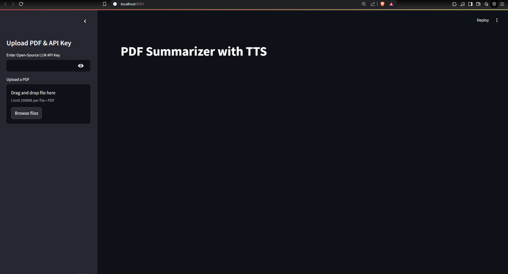
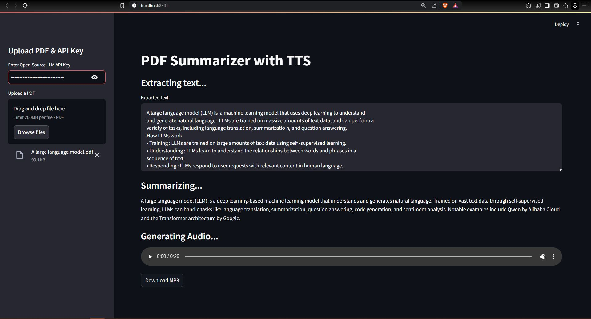

# Mistral-Personalized-LLM

Welcome to **Mistral-Personalized-LLM**, a simple and powerful **Streamlit-based web application** that extracts text from PDFs, summarizes content using the **Mistral API**, and converts the summary into speech using **Edge TTS**.

---

## 🚀 Features

✅ **Upload PDFs** – Extract text from uploaded PDF files using **PyPDF2**  
✅ **Summarization** – Generate concise summaries using **Mistral's LLM API**  
✅ **Text-to-Speech** – Convert the summary into audio using **Edge TTS**  
✅ **Downloadable MP3** – Save and download the generated speech file  
✅ **Simple UI** – Built with Streamlit for an intuitive user experience  

---

## 📂 Repository Link

🔗 **GitHub Repo**: [Mistral-Personalized-LLM](https://github.com/AyushAI/Mistral-Personalized-LLM)

---

## 🖼️ Screenshots

Here are some screenshots of the app in action:

### 📌 Home Page


### 📌 Summarization & TTS Output


---

## 🛠️ Setup Instructions

Follow these steps to run the app on your local machine:

### 1️⃣ Clone the Repository
```bash
git clone https://github.com/AyushAI/Mistral-Personalized-LLM.git
cd Mistral-Personalized-LLM
```

### 2️⃣ Create a Virtual Environment (Recommended)
```bash
python -m venv venv
# Activate it:
# On Windows:
venv\Scripts\activate
# On macOS/Linux:
source venv/bin/activate
```

### 3️⃣ Install Dependencies
```bash
pip install -r requirements.txt
```

### 4️⃣ Get Your Mistral API Key
- Sign up at [Mistral AI Console](https://console.mistral.ai/)
- Generate an API key from the **API Keys** section

### 5️⃣ Run the Streamlit App
```bash
streamlit run app.py
```

This will launch the app in your browser.

---

## 📜 Requirements

The required dependencies are listed in **requirements.txt** and include:
- `streamlit`
- `PyPDF2`
- `mistralai`
- `edge-tts`
- `asyncio`

Install them easily using:
```bash
pip install -r requirements.txt
```

---

## 📝 Usage Guide

1️⃣ **Upload a PDF** → Drag and drop a PDF file into the app.  
2️⃣ **Enter Mistral API Key** → Paste your API key in the sidebar.  
3️⃣ **Extract & Summarize** → The app extracts text and generates a concise summary.  
4️⃣ **Listen & Download** → Play or download the audio summary.  

---

## 🛠️ Troubleshooting

🔹 **Facing installation issues?** Ensure you have Python 3.8+ installed.  
🔹 **Error with Mistral API?** Double-check your API key and network connection.  
🔹 **No audio output?** Edge TTS might not be installed correctly; try reinstalling:
```bash
pip install edge-tts
```

---

## 📬 Contributing

Want to improve this project? Feel free to fork the repo, submit PRs, or open an issue!

---

## 🔗 Contact

📧 **Email**: [ayush.developer10@gmail.com](mailto:ayush.developer10@gmail.com)  

---

Enjoy using **Mistral-Personalized-LLM**! 🚀

